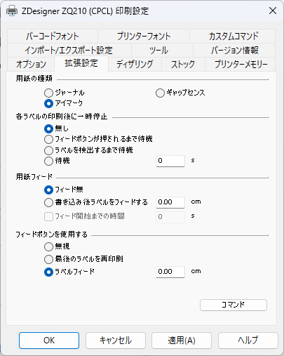
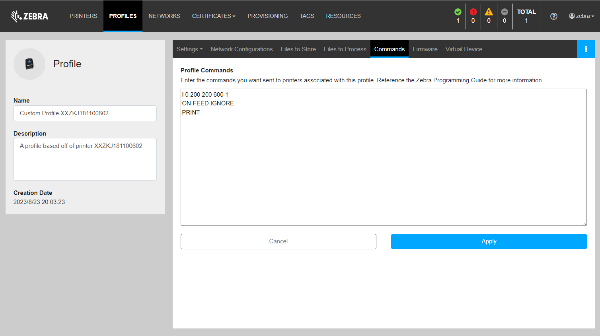

# モバイルプリンタにおいて、フィードボタン押下時の動作モードを変更する方法

モバイルプリンタにおいて、フィードボタンを押したときの動作を変更したい。わかります。

ゼブラ社のCPCL対応モバイルプリンタではフィードボタン押下時の動作モードを変更可能です。

 
 

***対象プリンタ***

- Link-OS ZQ シリーズプリンタ

    ※ ZT/ZD/ZE/ZCプリンタは非対応。

 
 

***Feedボタン押下時の動作モード***

| モード | Feedボタン押下時の動作 |
|-|-|
| Ignore    | 動作しない
| Feed      | ラベルを1枚フィードする
| Reprint   | 前回の印刷ジョブを再度実行する

 
 

動作モードの変更方法は下記の通りです。

 
 

## Windows Driver から変更する方法

Windows ドライバから設定変更が可能。

    Windows ドライバ > [プリンタのプロパティ] > [拡張設定] > [フィードボタンを使用する] 

▼  [拡張設定] 画面

 
 

## CPCL コマンドによる変更方法

****構文***

    ! U1 ON-FEED FEED<CR><LF>

****コマンド例（Ignore設定）***

    ! 0 200 200 600 1
    ON-FEED IGNORE
    PRINT

****コマンド例（Feed設定）***

    ! 0 200 200 600 1
    ON-FEED Feed
    PRINT

 

詳細はCPCL Programinnig Guide - [1.18ON-FEED] を参照すること。
[CPCL Programming Guide](https://www.zebra.com/content/dam/zebra_new_ia/en-us/manuals/printers/mobile/zr138/cpcl-link-os-pg-en.pdf)

 
 

## PPMEによる反映方法

Profile - Commandsへの記入で反映が可能。

